<div align="center">
  
</div>


<div align="center">
  
  
  
</div>

<br/>

<div align="center">
  
</div>

## 🌟 About Me


```javascript
const ibrahim = {
    name: "Ibrahim Ahmed",
    pronouns: "He/Him",
    location: "Cairo, Egypt 🇪🇬",
    company: "Watanya Company For Roads",
    role: "Frontend Developer",
    passion: "Creating Digital Magic ✨",
    
    techStack: {
        languages: ["JavaScript", "HTML5", "CSS3"],
        frameworks: ["React.js", "Tailwind CSS", "Sass"],
        tools: ["Git", "VS Code", "Figma", "Vite", "Webpack"],
        databases: ["Local Storage", "JSON", "REST APIs"],
        deployment: ["Vercel", "Netlify", "GitHub Pages"],
        design: ["Responsive Design", "UI/UX", "Animations"]
    },
    
    currentlyLearning: ["Advanced React Patterns", "Modern JavaScript", "TypeScript"],
    currentlyWorking: "Building stunning web experiences",
    
    lifePhilosophy: "Code is poetry written in logic 🎨",
    funFact: "I turn coffee into beautiful websites ☕➡️💻",
    
    dailyRoutine: {
        morning: "☕ Coffee + Planning",
        day: "💻 Coding + Learning",
        evening: "📚 Reading + Side Projects",
        night: "🌙 Dreaming in React"
    }
};

console.log("Welcome to my coding journey! 🚀");
```

<br clear="right"/>

## 🚀 Skills & Technologies

<div align="center">
  <br><br>
</div>

### Frontend Technologies
<div align="center">
  
</div>

### Development Tools
<div align="center">
  
</div>

### Design & Deployment
<div align="center">
  
  
</div>


---

## 📊 GitHub Analytics Dashboard

<div align="center">
  
</div>

<br/>

<div align="center">
  
  
</div>

<div align="center">
  
</div>

<div align="center">
  
</div>

## 🏆 Achievement Showcase

<div align="center">
  
</div>

<br/>

<div align="center">
  
</div>

---

## 🎯 Current Focus & Learning Journey

```mermaid
graph TD
    A[🎯 My Learning Path] --> B[🚀 Frontend Mastery]
    A --> C[🎨 Design Excellence]
    A --> D[⚡ Performance Optimization]

    B --> E[Advanced React Hooks]
    B --> F[Modern JavaScript ES2024]
    B --> G[TypeScript Integration]

    C --> H[UI/UX Principles]
    C --> I[Animation Libraries]
    C --> J[Design Systems]

    D --> K[Core Web Vitals]
    D --> L[Bundle Optimization]
    D --> M[Modern Deployment]

    style A fill:#FF6B6B,stroke:#fff,stroke-width:2px,color:#fff
    style B fill:#4ECDC4,stroke:#fff,stroke-width:2px,color:#fff
    style C fill:#45B7D1,stroke:#fff,stroke-width:2px,color:#fff
    style D fill:#96CEB4,stroke:#fff,stroke-width:2px,color:#fff
    style E fill:#FFEAA7,stroke:#333,stroke-width:1px,color:#333
    style F fill:#FFEAA7,stroke:#333,stroke-width:1px,color:#333
    style G fill:#FFEAA7,stroke:#333,stroke-width:1px,color:#333
    style H fill:#DDA0DD,stroke:#333,stroke-width:1px,color:#333
    style I fill:#DDA0DD,stroke:#333,stroke-width:1px,color:#333
    style J fill:#DDA0DD,stroke:#333,stroke-width:1px,color:#333
    style K fill:#98D8C8,stroke:#333,stroke-width:1px,color:#333
    style L fill:#98D8C8,stroke:#333,stroke-width:1px,color:#333
    style M fill:#98D8C8,stroke:#333,stroke-width:1px,color:#333
```

<div align="center">
  
</div>



### 🌟 What I'm Building

<div align="center">

| 🚧 Current Projects | 🎯 Focus Area | 🔥 Excitement Level |
|---------------------|---------------|---------------------|
| Interactive Portfolio | React + Animations | 🔥🔥🔥🔥🔥 |
| Component Library | Reusable UI | 🔥🔥🔥🔥 |
| Learning TypeScript | Type Safety | 🔥🔥🔥 |

</div>

---

## 💭 Coding Philosophy

<div align="center">
  
</div>

> ### "Clean code is not written by following a set of rules. You don't become a software craftsman by learning a list of heuristics. Professionalism and craftsmanship come from values that drive disciplines." 
> *- Clean Code Mindset*

<div align="center">

### 🎨 My Development Principles

| Principle | Description | Impact |
|-----------|-------------|---------|
| **🎯 User-Centric** | Every line of code serves the user experience | ⭐⭐⭐⭐⭐ |
| **⚡ Performance First** | Fast, responsive, optimized applications | ⭐⭐⭐⭐⭐ |
| **🧹 Clean Code** | Readable, maintainable, elegant solutions | ⭐⭐⭐⭐⭐ |
| **📱 Mobile-First** | Responsive design from the ground up | ⭐⭐⭐⭐ |
| **♿ Accessible** | Inclusive design for everyone | ⭐⭐⭐⭐ |

</div>

---

## 🌐 Let's Connect & Collaborate!

<div align="center">
  
</div>

<div align="center">

### 🚀 Ready to build something amazing together?

<a href="mailto:ibrahim.ahmed26@gmail.com">
  
</a>
<a href="https://www.linkedin.com/in/ibrahim-ahmed-53795a213/">
  
</a>
<a href="https://github.com/ibrahim-ahmed26">
  
</a>
<a href="https://twitter.com/ibrahim_ahmed26">
  
</a>

</div>

<div align="center">
  
</div>

### 💌 Open for Opportunities

- 🔥 **Freelance Projects** - Let's bring your ideas to life!
- 🤝 **Collaborations** - Open source contributions welcome
- 💼 **Full-time Roles** - Always interested in exciting opportunities
- 🎓 **Mentoring** - Happy to help fellow developers grow

---

<div align="center">
  
</div>

<div align="center">

### ✨ "Code is like humor. When you have to explain it, it's bad." ✨


**Thanks for visiting my profile! Keep coding and stay awesome! 🚀**

</div>


<div align="center">
  
</div>
