<div align="center">
  
</div>


<div align="center">
  
  
  
</div>

<p align="center">
  
</p>

## 🚀 About Me


```javascript
const ibrahim = {
    pronouns: "He/Him",
    location: "Cairo, Egypt 🇪🇬",
    company: "Watanya Company For Roads",
    role: "Frontend Developer",
    code: ["JavaScript", "HTML", "CSS", "React"],
    technologies: {
        frontEnd: {
            js: ["React", "JavaScript ES6+", "Vanilla JavaScript"],
            css: ["Tailwind CSS", "Sass", "CSS3"],
            ui: ["Figma", "Responsive Design", "Modern UI/UX"]
        },
        dataHandling: ["REST APIs", "JSON", "Fetch API", "Local Storage"],
        tools: ["Git", "VS Code", "npm", "Webpack", "Vite"],
        deployment: ["Vercel", "Netlify", "GitHub Pages"],
        misc: ["Responsive Design", "CSS Animations", "Modern JavaScript"]
    },
    currentFocus: "Building responsive and interactive web applications with React",
    funFact: "I debug with console.log() and I'm not ashamed! 😄",
    quote: "Clean code is simple and direct! ✨"
};
```

<br/>

## 🛠️ Tech Stack & Tools

<div align="center">
  
</div>

---

## 📊 GitHub Analytics

<div align="center">
  
  
</div>

<p align="center">
  
</p>

<p align="center">
  
</p>

## 🏆 GitHub Trophies

<p align="center">
  
</p>

## ✨ Featured Projects

<div align="center">

### 🎬 Movie PopCorn - React Movie Database
<a href="https://github.com/ibrahim-ahmed26/Movie-PopCorn">
  
</a>

**Features:** Movie search, ratings, watchlist, responsive design  
**Tech Stack:** React, JavaScript, REST API, CSS3

---

### 🌍 WorldWize - Travel Tracking App
<a href="https://github.com/ibrahim-ahmed26/WorldWize-Vite">
  
</a>

**Features:** Interactive maps, city tracking, travel logs  
**Tech Stack:** React, Vite, Context API, CSS Modules

---

### ⚛️ Atomic Blog - Modern Blog Platform
<a href="https://github.com/ibrahim-ahmed26/Atomic-Blog">
  
</a>

**Features:** Post creation, search functionality, dark mode  
**Tech Stack:** React, Context API, Local Storage, CSS3

</div>

---

## 🚀 Current Goals & Learning Path

```mermaid
graph TD
    A[🚀 Current Focus] --> B[Advanced React Patterns]
    A --> C[Modern JavaScript ES6+]
    A --> D[UI/UX Design]

    B --> E[Custom Hooks]
    B --> F[Context API]
    B --> G[State Management]

    C --> H[Async/Await]
    C --> I[Modern Features]
    C --> J[API Integration]

    D --> K[Responsive Design]
    D --> L[User Experience]
    D --> M[Modern UI]
```



## 🙋 Connect & Collaborate

<div align="center">

### Let's build something amazing together! 🚀

<a href="mailto:ibrahim.ahmed26@gmail.com">
  
</a>
<a href="https://www.linkedin.com/in/ibrahim-ahmed-53795a213/">
  
</a>
<a href="https://github.com/ibrahim-ahmed26">
  
</a>
<a href="https://twitter.com/ibrahim_ahmed26">
  
</a>

</div>

---

<div align="center">
  
</div>
