<div align="center">
  
</div>

<div align="center">
  
  
  
</div>

<br/>

<div align="center">
  
</div>

## 🚀 About Me


```javascript
const ibrahim = {
    pronouns: "He/Him",
    location: "Cairo, Egypt 🇪🇬",
    company: "Watanya Company For Roads",
    role: "Frontend Developer",
    code: ["JavaScript", "HTML", "CSS", "React"],
    technologies: {
        frontEnd: {
            js: ["React", "JavaScript ES6+", "Vanilla JavaScript"],
            css: ["Tailwind CSS", "Sass", "CSS3"],
            ui: ["Figma", "Responsive Design", "Modern UI/UX"]
        },
        dataHandling: ["REST APIs", "JSON", "Fetch API", "Local Storage"],
        tools: ["Git", "VS Code", "npm", "Webpack", "Vite"],
        deployment: ["Vercel", "Netlify", "GitHub Pages"],
        misc: ["Responsive Design", "CSS Animations", "Modern JavaScript"]
    },
    currentFocus: "Building responsive and interactive web applications with React",
    funFact: "I debug with console.log() and I'm not ashamed! 😄",
    quote: "Clean code is simple and direct! ✨"
};
```

<br clear="both"/>

<div align="center">
  
</div>

## 🛠️ Tech Stack & Tools

<div align="center">
  
### 🎨 Frontend Technologies
<table>
  <tr>
    <td align="center" width="96">
      
      <br><strong>React</strong>
    </td>
    <td align="center" width="96">
      
      <br><strong>JavaScript</strong>
    </td>
    <td align="center" width="96">
      
      <br><strong>HTML5</strong>
    </td>
    <td align="center" width="96">
      
      <br><strong>CSS3</strong>
    </td>
    <td align="center" width="96">
      
      <br><strong>Tailwind</strong>
    </td>
    <td align="center" width="96">
      
      <br><strong>Sass</strong>
    </td>
  </tr>
</table>

### 🎭 Styling & UI Frameworks
<table>
  <tr>
    <td align="center" width="96">
      
      <br><strong>Material-UI</strong>
    </td>
    <td align="center" width="96">
      
      <br><strong>Figma</strong>
    </td>
    <td align="center" width="96">
      
      <br><strong>Responsive Design</strong>
    </td>
    <td align="center" width="96">
      
      <br><strong>Photoshop</strong>
    </td>
    <td align="center" width="96">
      
      <br><strong>UI/UX Design</strong>
    </td>
    <td align="center" width="96">
      
      <br><strong>CSS Animation</strong>
    </td>
  </tr>
</table>

### 🛠️ Development Tools
<table>
  <tr>
    <td align="center" width="96">
      
      <br><strong>VS Code</strong>
    </td>
    <td align="center" width="96">
      
      <br><strong>Git</strong>
    </td>
    <td align="center" width="96">
      
      <br><strong>GitHub</strong>
    </td>
    <td align="center" width="96">
      
      <br><strong>npm</strong>
    </td>
    <td align="center" width="96">
      
      <br><strong>Webpack</strong>
    </td>
    <td align="center" width="96">
      
      <br><strong>Vite</strong>
    </td>
  </tr>
</table>

### 🔌 API & Data Integration
<table>
  <tr>
    <td align="center" width="96">
      
      <br><strong>REST APIs</strong>
    </td>
    <td align="center" width="96">
      
      <br><strong>JSON</strong>
    </td>
    <td align="center" width="96">
      
      <br><strong>Fetch API</strong>
    </td>
    <td align="center" width="96">
      
      <br><strong>Async/Await</strong>
    </td>
    <td align="center" width="96">
      
      <br><strong>AJAX</strong>
    </td>
    <td align="center" width="96">
      
      <br><strong>Local Storage</strong>
    </td>
  </tr>
</table>

</div>

<br/>

<div align="center">
  
</div>

## 📊 GitHub Analytics

<div align="center">
  
  
</div>

<br/>

<div align="center">
  
</div>

<br/>

<div align="center">
  
</div>

## 🏆 GitHub Trophies

<div align="center">
  
</div>

<div align="center">
  
</div>

## 🌟 Featured Projects

<div align="center">

### 🎬 Movie PopCorn - React Movie Database
<a href="https://github.com/ibrahim-ahmed26/Movie-PopCorn">
  
</a>

**Features:** Movie search, ratings, watchlist, responsive design  
**Tech Stack:** React, JavaScript, REST API, CSS3

---

### 🌍 WorldWize - Travel Tracking App  
<a href="https://github.com/ibrahim-ahmed26/WorldWize-Vite">
  
</a>

**Features:** Interactive maps, city tracking, travel logs  
**Tech Stack:** React, Vite, Context API, CSS Modules

---

### ⚛️ Atomic Blog - Modern Blog Platform
<a href="https://github.com/ibrahim-ahmed26/Atomic-Blog">
  
</a>

**Features:** Post creation, search functionality, dark mode  
**Tech Stack:** React, Context API, Local Storage, CSS3

</div>

<div align="center">
  
</div>

## 🎯 Current Goals & Learning Path

```mermaid
graph TD
    A[🎯 Current Focus] --> B[Advanced React Patterns]
    A --> C[Modern JavaScript ES6+]
    A --> D[UI/UX Design]
    
    B --> E[Custom Hooks]
    B --> F[Context API]
    B --> G[State Management]
    
    C --> H[Async/Await]
    C --> I[Modern Features]
    C --> J[API Integration]
    
    D --> K[Responsive Design]
    D --> L[User Experience]
    D --> M[Modern UI]
```

<div align="center">



</div>

### 🚀 What I'm Currently Working On:
- 🔭 **Building:** Advanced React projects with modern JavaScript patterns
- 🌱 **Learning:** Advanced React hooks, state management, and modern CSS techniques
- 👯 **Collaborating on:** Open source React components and frontend tools
- 🎯 **2024-2025 Goals:** Master advanced React patterns and create amazing user experiences
- 📝 **Exploring:** Modern frontend architecture and responsive design principles

### 🎨 Fun Facts:
- ⚡ I can solve a Rubik's cube in under 2 minutes! 🧩
- 🎮 I debug with console.log() and I'm proud of it! 😄
- 🌙 Night owl developer - best code happens after midnight
- ☕ Coffee-driven development is my superpower

## 📈 Weekly Development Breakdown

<!--START_SECTION:waka-->
```text
JavaScript   10 hrs 30 mins  ███████████████████▓░░░  78.5%
CSS          2 hrs 45 mins   █████▓░░░░░░░░░░░░░░░░░  16.2%
HTML         35 mins         ▓░░░░░░░░░░░░░░░░░░░░░░░  4.1%
JSON         10 mins         ▓░░░░░░░░░░░░░░░░░░░░░░░  1.2%
```
<!--END_SECTION:waka-->

<div align="center">
  
</div>

## 🎨 My Coding Philosophy

<div align="center">

> ### *"Code is poetry written in logic"* ✨
> 
> I believe in writing clean, maintainable code that tells a story.  
> Every function should have a purpose, every component should be reusable,  
> and every project should solve real-world problems.

<br/>


</div>

## 🤝 Connect & Collaborate

<div align="center">
  
### Let's build something amazing together! 🚀

<a href="mailto:ibrahim.ahmed26@gmail.com">
  
</a>
<a href="https://www.linkedin.com/in/ibrahim-ahmed-53795a213/">
  
</a>
<a href="https://github.com/ibrahim-ahmed26">
  
</a>
<a href="https://twitter.com/ibrahim_ahmed26">
  
</a>

<br/><br/>

### 💬 I'm always open to:
- 🤝 Collaborating on interesting projects
- 💡 Discussing new technologies and ideas
- 🎓 Mentoring junior developers
- 📝 Writing technical articles
- 🎯 Contributing to open source

</div>

<div align="center">
  
</div>

---

<div align="center">
  
</div>

<div align="center">
  <h3>⭐️ From <a href="https://github.com/ibrahim-ahmed26">Ibrahim Ahmed</a></h3>
  <p><i>"Turning coffee into code, one commit at a time" ☕️💻</i></p>
  
  
  
</div>
